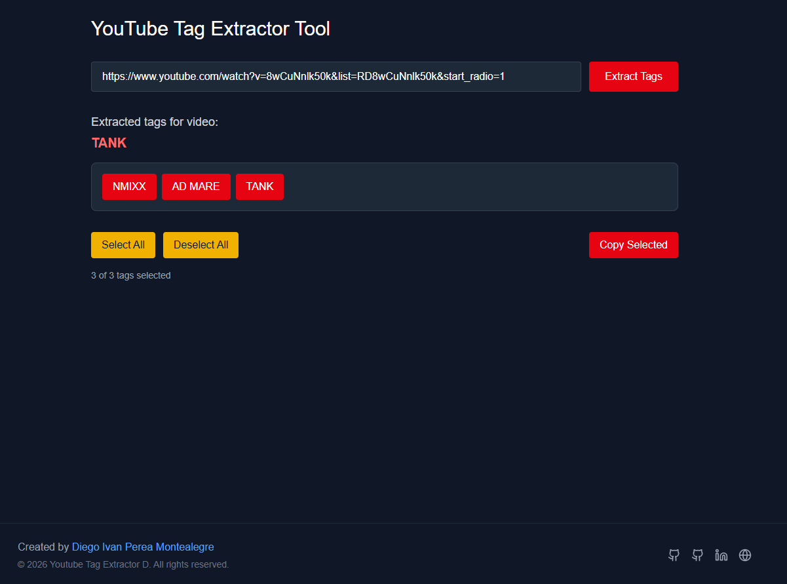

# 🏷️ YouTube Tag Extractor D


A modern web application that allows you to extract tags from YouTube videos quickly and easily. Simply enter the video URL and get all the tags used to optimize your own content.

## 📸 Preview

<p align="center">
  
</p>

## ✨ Features

- 🚀 **Fast Extraction**: Get tags from any YouTube video instantly
- 🎯 **Interactive Selection**: Select/deselect tags individually
- 📋 **One-Click Copy**: Copy selected tags to clipboard
- 🎨 **Modern Interface**: Elegant dark design with Tailwind CSS

## 🛠️ Technologies Used

- **Frontend**: Next.js 16.1.6 with React 19.2.3
- **Language**: TypeScript 5
- **Styling**: Tailwind CSS 4
- **Icons**: Lucide React
- **Web Scraping**: Cheerio for tag extraction

## 🚀 Getting Started

### Prerequisites

- Node.js 18+ installed
- npm or yarn

### Installation

1. Clone the repository:

```bash
git clone
```

2. Install dependencies:

```bash
npm install
```

3. Start the development server:

```bash
npm run dev
```

4. Open [http://localhost:3000](http://localhost:3000) in your browser

### 📄 License

This project is licensed under the MIT License - see the [LICENSE](LICENSE) file for details.

---

## 👨‍💻 Author

**Diego Ivan Perea Montealegre**

- GitHub: [@diegoperea20](https://github.com/diegoperea20)

---

Created by [Diego Ivan Perea Montealegre](https://github.com/diegoperea20)
